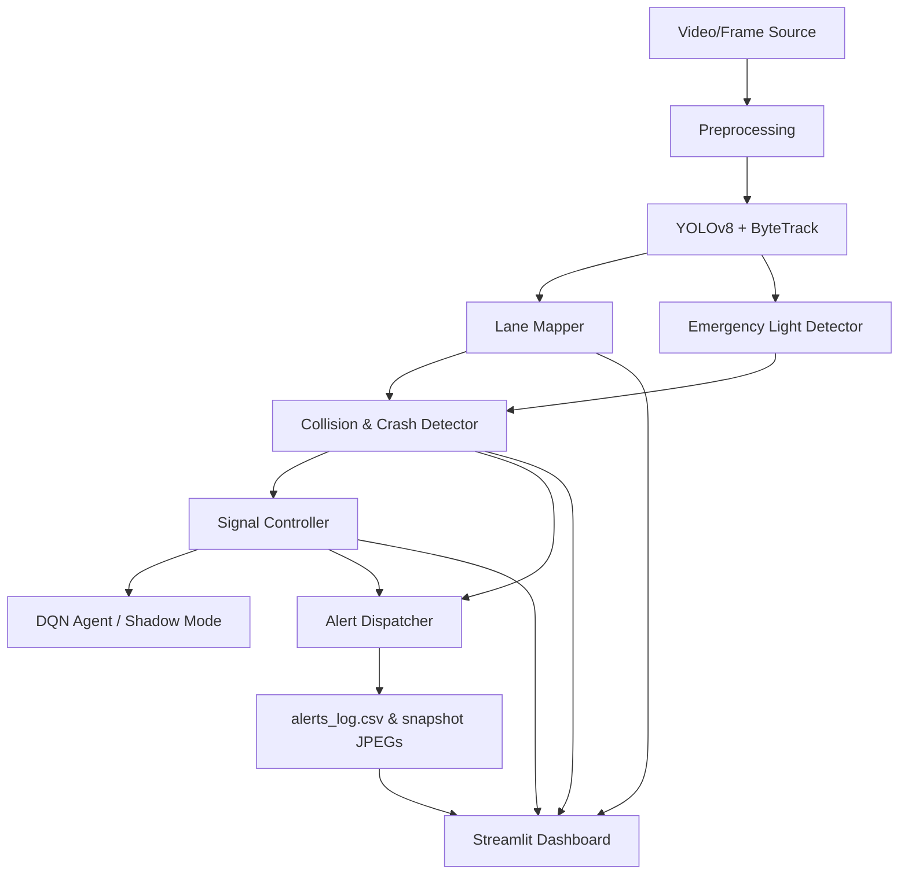

# AI-Driven Intelligent Traffic Control and Management System

## Overview
The AI-Driven Intelligent Traffic Control and Management System is a comprehensive, multi-phase system designed to optimize urban traffic flow through real-time computer vision, adaptive rule-based signal control, emergency preemption, incident/crash detection, and offline reinforcement learning (DQN). The system leverages advanced object tracking and lane mapping algorithms to feed data to a custom Streamlit control center dashboard.

---

## Features
- **Real-Time Vehicle Detection & Tracking**: Employs YOLOv8 with ByteTrack to track vehicles dynamically across frames.
- **Dynamic Lane Assignment**: Maps coordinate bounding boxes to specific lanes (`left_road`, `bottom_road`, `right_road`, `top_road`) with polygons.
- **Dual-Source Emergency Vehicle Preemption**: Combines YOLOv8 classification (ambulances, fire trucks, police cars) with a custom computer vision flashing emergency light detector (essential for night/glare conditions).
- **Multi-Signal Crash Detection**: Computes a confidence score based on IoU overlap, vehicle vanishing clusters, lane count drops, and opposite trajectory direction conflicts, with a temporal persistence filter.
- **Adaptive Signal Control**: Executes a 4-level priority control loop:
  1. *Crash Red Override*: Safety-first override to prevent more vehicles from entering a collision lane.
  2. *Emergency Preemption*: Immediately preempts normal rotation to green-light emergency routes.
  3. *Anti-Starvation Promotion*: Promotes starved lanes skipped too many times.
  4. *Density-Proportional Timing / DQN*: Scales green light duration based on demand.
- **Deep Q-Network (DQN) Optimization**: Employs a reinforcement learning agent trained offline on historical traffic log data (`traffic_log.csv`) for optimal phase selection.
- **Live Streamlit Dashboard**: Interacts with the real-time pipeline, displaying active vehicle bounding boxes, lane density statistics, crash alerts, signal logs, and DQN prediction states.

---

## Tech Stack
- **Core Language**: Python 3.x
- **Computer Vision & ML**: OpenCV, YOLOv8 (`ultralytics`), PyTorch
- **Data Engineering**: NumPy, Pandas, python-dotenv
- **Reinforcement Learning**: PyTorch DQN (Deep Q-Network)
- **Web App Dashboard**: Streamlit, Plotly

---

## Architecture


### Request and Data Flow
1. **Frame Input & Preprocessing**: Images are loaded, resized, and optionally enhanced with CLAHE contrast adjustments.
2. **Detection & Tracking**: YOLOv8 extracts vehicle coordinates, labels, and tracking IDs using ByteTrack.
3. **Lane Assignment**: Bounding boxes are projected onto polygons mapped to specific intersection lanes.
4. **Safety & Anomaly Processing**: Parallel workers compute low-level vehicle collisions and detect emergency flashing lights.
5. **Incidents & Alerts**: The `CrashDetector` aggregates signals; once a threshold is met for 3+ consecutive frames, `AlertDispatcher` logs the crash, saves a snapshot, and triggers notifications.
6. **Adaptive Signaling**: The `SignalController` runs every frame to dynamically update traffic light states, overriding density calculations for high-priority emergency preemption or crash red overrides.

---

## Folder Structure
```text
Traffic_AI/
├── .streamlit/             # Streamlit configuration
│   └── config.toml         # Dashboard UI theme settings
├── alerts/                 # Saved crash snapshot JPEGs
├── Traffic_Footage_Demo/   # Demo frame directory for testing
├── Traffic_Footage_Sanity/ # Sanity frame directory
├── alert_dispatcher.py     # Dispatches crash alerts, logs to CSV, sends HTTP/Telegram alerts
├── collision_detector.py   # Low-level frame-by-frame bounding-box intersection calculations
├── crash_detector.py       # High-level confidence-based crash logic with persistence filter
├── dashboard.py            # Streamlit dashboard interface
├── data_logger.py          # Silently logs state transition vectors to CSV for DQN training
├── detector.py             # Advanced vehicle detector wrapper using YOLOv8
├── dqn_agent.py            # PyTorch Deep Q-Network policy inference module
├── emergency_detector.py   # Flashing color and light thresholding for emergency vehicles
├── example_usage.py        # Demo script demonstrating the pipeline loop
├── lane_mapper.py          # Poly-based vehicle-to-lane assignment and lane statistics
├── lane_mapping_conf.py    # Lane boundary polygons coordinate configurations
├── pipeline.py             # Main processing pipeline orchestrating all modules
├── preprocessing.py        # Video resizing and image quality enhancements (CLAHE)
├── requirements.txt        # Package dependencies list
├── run_ai_priority.py      # Entrypoint script to run pipeline with AI priority settings
├── signal_controller.py    # Adaptive signal control with anti-starvation & priorities
├── signal_logger.py        # Event logger tracking signal phase switches
├── train_dqn.py            # Reinforcement learning trainer script for offline policy optimization
└── update_signal.py        # Script to update signal configurations dynamically
```

---

## Getting Started

### Prerequisites
1. Install Python 3.8+.
2. Download PyTorch CPU build first:
   ```bash
   pip install torch torchvision --index-url https://download.pytorch.org/whl/cpu
   ```
3. Install dependencies:
   ```bash
   pip install -r requirements.txt
   ```

### Run Dashboard
Start the real-time monitoring Command Center:
```bash
streamlit run dashboard.py
```

### Run CLI Pipeline Demo
To run the traffic pipeline locally and output logs:
```bash
python example_usage.py
```
